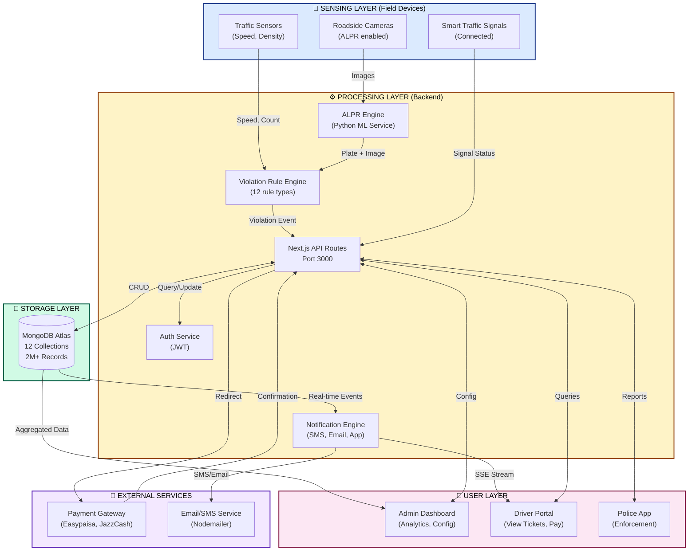
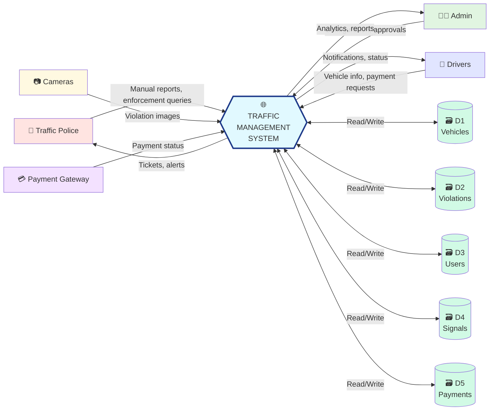
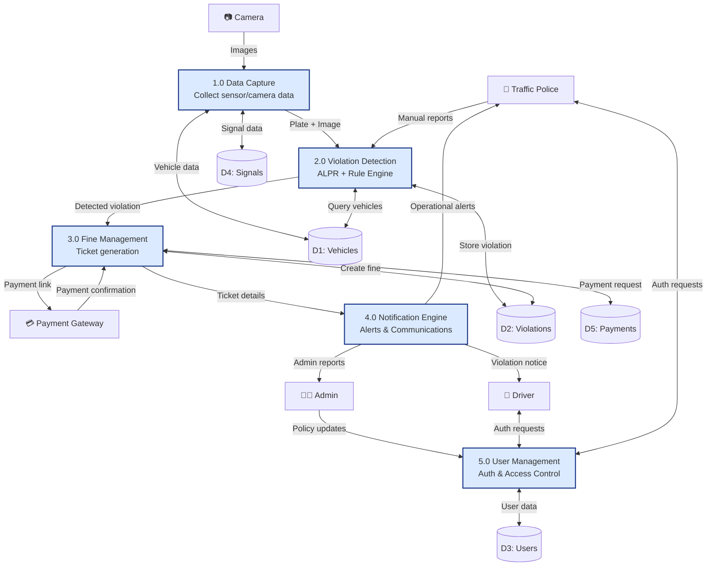
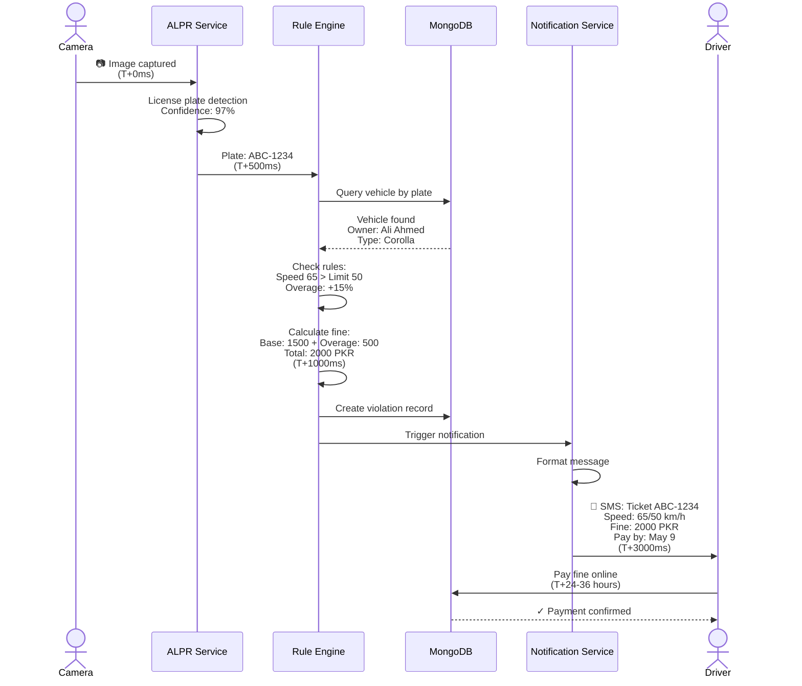
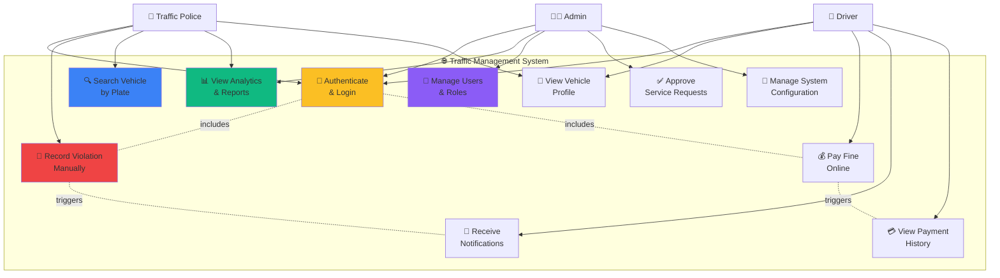
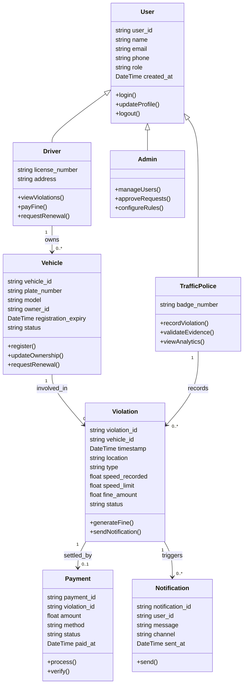
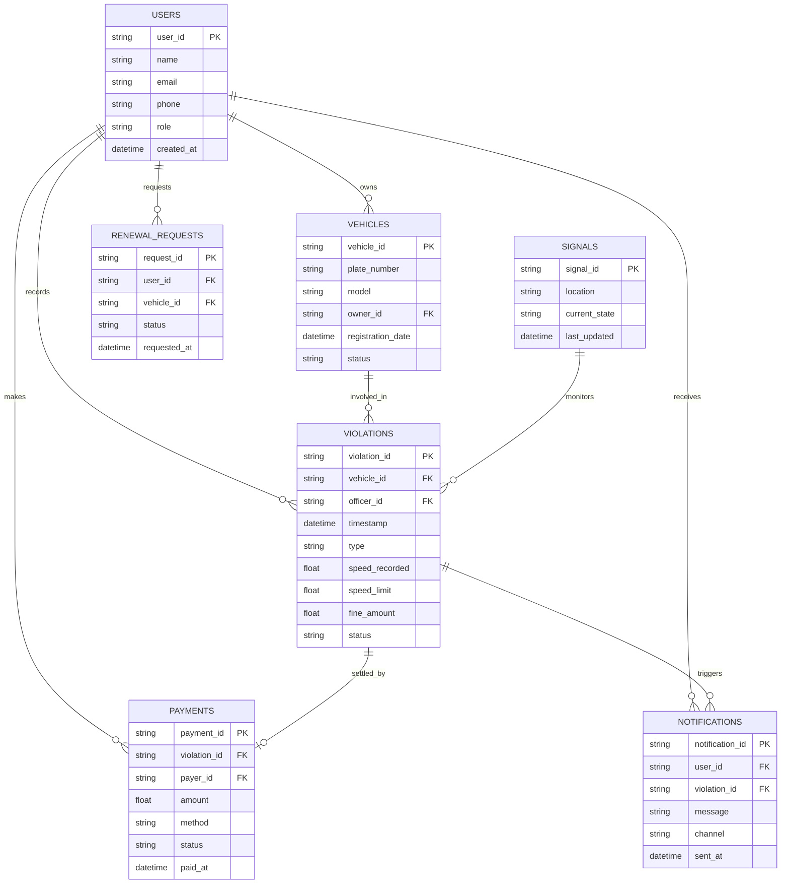
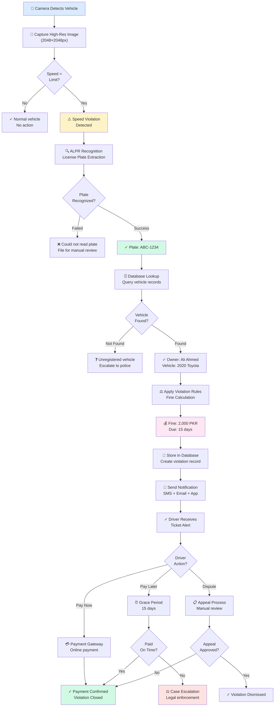
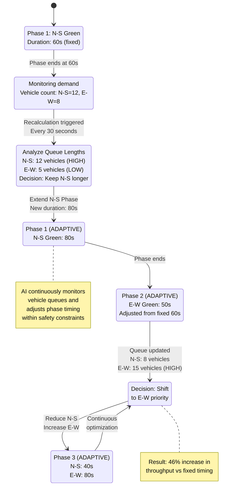

# Traffic System Visual Assets
## Mermaid Diagram Templates & Examples

Copy-paste ready Mermaid code for all system diagrams.

---

## 1. SYSTEM ARCHITECTURE DIAGRAM

**Purpose:** Show complete system layers and data flow
**Usage:** Save as `.mmd` file and render with Mermaid Live Editor or VS Code extension

---

## 2. DATA FLOW DIAGRAM - LEVEL 0 (Context)

---

## 3. DATA FLOW DIAGRAM - LEVEL 1 (Processes)

---

## 4. SEQUENCE DIAGRAM - VIOLATION LIFECYCLE

---

## 5. USE CASE DIAGRAM

---

## 6. CLASS DIAGRAM (OOP Model)

---

## 7. ENTITY-RELATIONSHIP DIAGRAM

---

## 8. FLOWCHART - VIOLATION DETECTION & PAYMENT WORKFLOW

---

## 9. ADAPTIVE SIGNAL CONTROL STATE MACHINE

---

## USAGE INSTRUCTIONS

1. Copy the Mermaid code block for desired diagram
2. Paste into one of:
   - **VS Code:** Install "Markdown Preview Mermaid Support" extension
   - **Online:** Paste at https://mermaid.live/
   - **File:** Save as `.mmd` and render with Mermaid CLI or web tool
3. Export as PNG/SVG for reports
4. Customize colors, labels, and entity names as needed

---

**Version:** 1.0  
**Last Updated:** April 24, 2026
